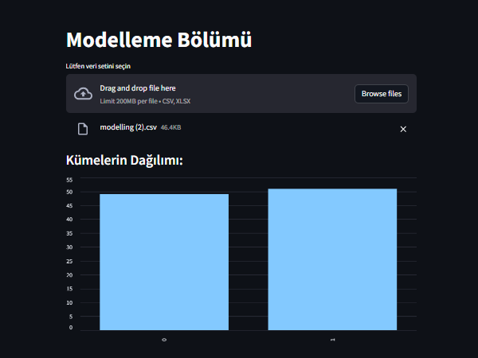
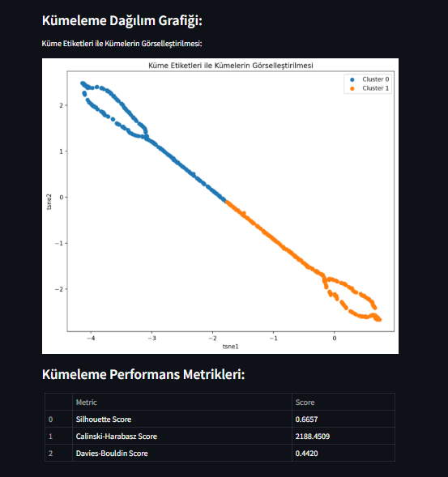

# Müşteri Segmentasyonu Arayüzü

Bu arayüz, 2024 yılı lisans bitirme projem kapsamında geliştirilen Müşteri Segmentasyonu ve Öneri Sistemi çalışmasının görsel ve etkileşimli bir uzantısıdır.
Python programlama dili ve Streamlit kütüphanesi kullanılarak geliştirilen bu uygulama, kullanıcıya veri ön işleme, modelleme ve sonuç analizlerini kolayca gerçekleştirme imkânı sunar.

## Özellikler ve Dosya Yapısı

CSV formatındaki müşteri verileri indirildikten sonra bu arayüz üzerinden işlenip analiz edilebilir. Bazı analizlerde sistemden doğrudan veri çekilemediği durumlarda, analiz sonuçlarını desteklemek amacıyla ilgili görseller (örneğin .png formatında) manuel olarak yüklenmiştir.

Uygulamanın temel modülleri şunlardır:
- `anasayfa.py`:Ana çalışma ekranı ve yönlendirme arayüzü
- `data_cleaning.py`, `dp_end.py`:: Eksik veri temizleme ve ön işleme adımları
- `feature_engineering.py`: Özellik oluşturma ve dönüştürme işlemleri
- `modelling.py`: Kümeleme algoritmaları ve öneri sistemi
- `performance.py`: Model başarımları ve analizler

## Veri Kullanımı
Kullanıcılar arayüz üzerinden:

Kendi CSV dosyalarını yükleyebilir,
Sistem içinde hazır bulunan görsellerden yararlanabilir,
Tüm analiz adımlarını adım adım takip edebilir.

### 📷 Ekran Görüntüsü: Dosya Yükleme ve Küme Dağılımı

---

## Kümeleme Sonuçları ve Performans

Bu proje kapsamında uygulanan kümeleme algoritmalarının görsel çıktıları ve başarı metrikleri aşağıda yer almaktadır:

### 📷 Ekran Görüntüsü: Kümeleme Dağılımı ve Metrikler

**Kullanılan metrikler:**
- Silhouette Score
- Calinski-Harabasz Score
- Davies-Bouldin Score

---

## Detaylı Açıklama
Bu arayüz, e-ticaret veri setlerinin işlenmesi ve anlamlı segmentlerin oluşturulması için tasarlanmıştır. Aynı zamanda öneri sistemiyle kullanıcıya özel içerikler sunulmasına olanak tanır.

👉 **Bu sürecin nasıl tasarlandığı ve kullanılan yöntemlerin detayları için:**  
[Proje Reposuna Git](https://github.com/elifkaradenizz/bitirme_projesi_ymu_2024)  
